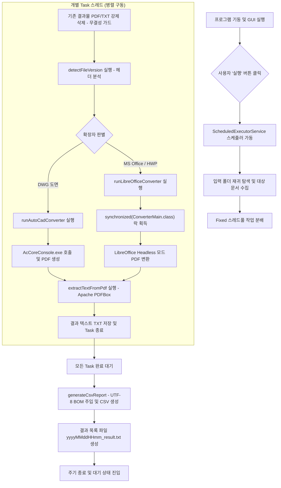

# [설계 문서] IPLMS Hybrid Converter (GUI & AutoCAD 확장형)

## 1. 개요 (Overview)

본 프로그램은 지정된 폴더 내의 다양한 오피스 문서(MS Office, 한컴오피스) 및 **AutoCAD 도면**을 주기적으로 탐색하여 PDF 변환 및 텍스트 추출을 수행하는 Java 기반의 하이브리드 문서 변환 엔진입니다.

* **하이브리드 아키텍처**: 자바의 안정적인 제어 로직과 LibreOffice(오피스) 및 AutoCAD(도면)의 전문 렌더링 엔진을 결합하여 초고성능과 완벽한 서식 보존을 보장합니다.
* **지원 포맷**:
  * **MS Office**: Word(.docx, .doc), Excel(.xlsx, .xls), PowerPoint(.pptx, .ppt)
  * **한컴오피스**: HWP(v5.0 이상), HWPX(표준 v1.0)
  * **AutoCAD**: **DWG **
* **주요 기능**: GUI 기반 제어, 실시간 로그 출력, 멀티스레드 병렬 처리, 내장 HTTP REST API 지원.

---

## 2. 상세 비즈니스 프로세스 흐름 (Detailed Flow Diagram)

프로그램 기동부터 최종 리포트 생성 및 API 처리까지의 전체 프로세스 흐름입니다.



---

## 3. 시스템 아키텍처 (System Architecture)

1. **GUI (ConverterGUI)**: JFrame 기반 메인 윈도우(800x600)를 통해 서비스 제어 및 실시간 상태 로그를 모니터링합니다.
2. **메인 스케줄러**: `ScheduledExecutorService`를 통해 설정된 주기에 따라 폴더 스캔 및 변환 작업을 수행합니다.
3. **내장 웹 서버**: `/api/convert` 엔드포인트를 통해 단일 파일 즉시 변환 요청을 수신합니다.
4. **변환 제어 유닛 (ConverterMain)**:
   * **LibreOffice Engine**: 오피스 및 한글 문서의 PDF 렌더링 담당.
   * **AutoCAD AcCoreConsole**: DWG 도면의 고정밀 PDF 변환 담당 (신규 확장).
   * **Apache PDFBox**: 변환된 PDF로부터 고속 텍스트 추출 수행.

---

## 4. 신뢰성 및 예외 가드 설계 (Reliability Guards)

* **프로필 락 가드 (Profile Lock)**: 리브레오피스 중복 호출 시 발생하는 프로세스 크래시를 방지하기 위해 `synchronized (ConverterMain.class)` 블록으로 순차 진입을 보장합니다.
* **타임아웃 가드 (Timeout Guard)**: 대용량 또는 손상된 파일로 인한 무한 루프를 방지합니다. 일반 문서는 30~90초, **DWG는 90초 이상** 설정을 권장합니다.
* **무결성 덮어쓰기 가드**: 변환 시작 전 기존 결과물(.pdf, .txt)을 강제로 삭제하여 파일 잠금 현상을 차단합니다.
* **엑셀 인코딩 가드 (UTF-8 BOM)**: 한국형 엑셀에서의 한글 깨짐 방지를 위해 CSV 생성 시 맨 앞에 **0xEF, 0xBB, 0xBF** 바이트를 강제 주입합니다.

---

## 5. AutoCAD DWG 변환 확장 설계 (Functional Extension)

도면 재현율 극대화를 위해 AutoCAD의 정식 콘솔 엔진인 `AcCoreConsole.exe`를 활용합니다.

### 5.1. 환경 설정 (`config.properties`)

```properties
# AutoCAD AcCoreConsole 실행 바이너리 절대 경로
converter.autocad.path=C:\\Program Files\\Autodesk\\AutoCAD 2024\\accoreconsole.exe

# AutoCAD 변환용 스크립트(.scr) 파일 경로
converter.autocad.script.path=C:\\IPLMS\\scripts\\dwg2pdf.scr
```

### 5.2. 운영 고려 사항

* **CLI 호출 방식**: `accoreconsole.exe /i "입력파일.dwg" /s "스크립트.scr" /l "en-US"` 명령어를 `ProcessBuilder`로 실행합니다.
* **서버 요건**: 운영 서버에 **AutoCAD 정식 라이선스 활성화**가 되어 있어야 하며, 도면용 **SHX 폰트**가 시스템에 사전 설치되어야 합니다.

---

## 6. REST API 사용 가이드 (REST API Guide)

### 6.1. 기본 정보

* **엔드포인트**: `http://[IP]:9119/api/convert` (포트는 설정 가능).
* **지원 메소드**: GET (테스트용), POST (인터페이스용).
* **CORS**: 타 도메인 호출이 가능하도록 기본적으로 허용됩니다.

### 6.2. 요청 및 응답 예제

* **요청 파라미터 (POST JSON)**:
  
  ```json
  { "filePath": "C:\\IPLMS\\91_input\\sample.dwg" }
  ```
* **성공 응답 (JSON)**:
  
  ```json
  {
    "status": "success",
    "pdfPath": "C:\\IPLMS\\92_output\\sample.pdf",
    "txtPath": "C:\\IPLMS\\92_output\\sample.txt",
    "txtExtracted": true,
    "elapsedTime": "13.02초"
  }
  ```

---

## 7. 시스템 구축 및 설치 정보

* **권장 경로**: 모든 솔루션은 `C:\IPLMS` 루트 디렉토리에 설치하는 것을 권장합니다.
* **폴더 구조**:
  * `C:\IPLMS\91_input`: 원본 문서 보관.
  * `C:\IPLMS\92_output`: 결과 PDF, TXT 및 CSV 리포트 저장.
  * `C:\IPLMS\LibreOfficePortable`: 변환 엔진 영역.
  * `C:\IPLMS\IPLMSDocsConverter_jar`: 자바 프로그램 및 라이브러리 보관.

---

## 8. 최종 산출물 스펙 (Output Spec)

* **변환본**: 원본 파일명 기반의 `.pdf` 및 `.txt`.
* **시스템 리포트**: `conversion_report.csv` (상세 메타데이터 포함).
* **실행 목록**: `yyyyMMddHHmm_result.txt` (해당 주기에 생성된 파일 전체 경로 목록).