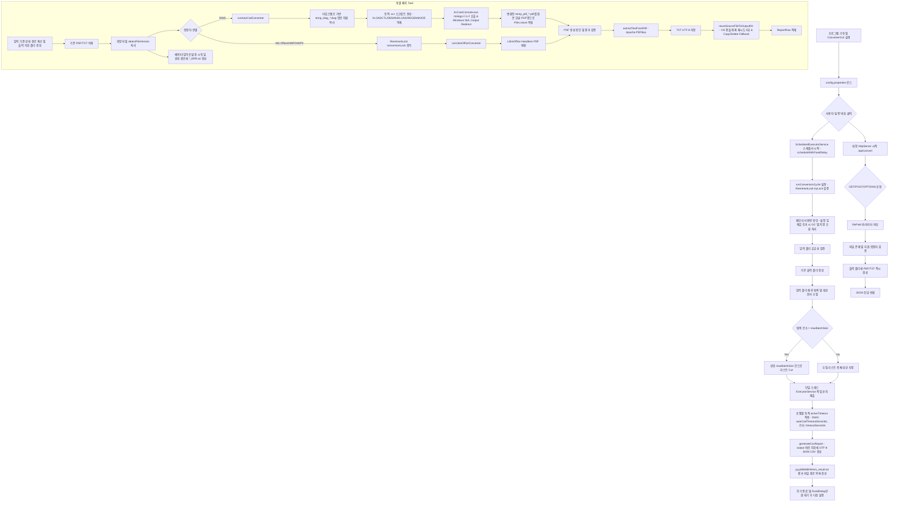

반갑습니다, 선배님. 현장에서 ENOVIA JPO/MQL 백엔드 구축부터 Java/ProcessBuilder 파이프라인 최적화까지 함께 고민해 온 25년 차 동료 개발자입니다.

제시해주신 최신 소스 코드(`ConverterMain.java`, `ConverterGUI.java`, `config.properties`)와 기존 `design.md` 문서를 정밀하게 비교 분석하였습니다.

그동안 우리가 함께 개선했던 **① 동적 배치 제한(Chunking), ② 스케줄링 오버랩 방지(Fixed Delay & Lock), ③ AutoCAD 성능 최적화 및 Windows NUL 버퍼 데드락 차단, ④ OS 파일 핸들 지연 재시도(Retry/Fallback), ⑤ 타임스탬프 기반 영문 치환 파이프라인** 관련 변경사항들이 설계서에 누락되어 있어, 이를 명확히 보완한 **`design.md` 개정안 설계서**를 작성했습니다.

---

# [설계 문서] IPLMS Hybrid Converter (GUI & AutoCAD 확장형) - 개정안

## 1. 개요 (Overview)

본 프로그램은 지정된 입력 폴더 내의 다양한 오피스 문서(MS Office, 한컴오피스) 및 **AutoCAD DWG 도면**을 주기적으로 탐색하여 PDF 변환, PDF 텍스트 추출, 변환 리포트 생성을 수행하는 Java 기반 하이브리드 문서 변환 엔진입니다.

* **하이브리드 아키텍처**: Java 제어 로직과 LibreOffice(오피스/한글 문서), AutoCAD AcCoreConsole(DWG 도면), Apache PDFBox(텍스트 추출)를 결합합니다.


* **지원 포맷**:
* **MS Office**: Word(.docx, .doc), Excel(.xlsx, .xls), PowerPoint(.pptx, .ppt)


* **한컴오피스**: HWP(.hwp), HWPX(.hwpx)


* **AutoCAD**: DWG(.dwg)


* **주요 기능**: Swing GUI 기반 서비스 제어, 컬러 태그 실시간 로그, 일자별 파일 로그, 청크 단위 스케줄링 배치 변환, 내장 HTTP REST API 기반 단일 파일 즉시 변환, CSV 리포트 및 결과 목록 생성.


---

## 2. 상세 비즈니스 프로세스 흐름 (Detailed Flow Diagram)

프로그램 기동부터 정기 변환 주기, REST API 처리, 산출물 생성까지의 전체 프로세스 흐름입니다.


```mermaid
graph TD
    A[프로그램 기동 및 ConverterGUI 실행] --> B[config.properties 로드]
    B --> C{사용자 '실행' 버튼 클릭}
    C --> D[ScheduledExecutorService 스케줄러 시작 - scheduleWithFixedDelay]
    C --> API[내장 HttpServer 시작 /api/convert]

    D --> E[runConversionCycle 실행 - ReentrantLock tryLock 검증]
    E --> F[메모리 사용량 확인 - 설정 임계값 초과 시 GC 및 치명 오류 처리]
    F --> G[입력 폴더 유효성 검증]
    G --> H[기본 출력 폴더 생성]
    H --> I[입력 폴더 재귀 탐색 및 대상 문서 수집]
    I --> J{탐색 건수 > maxBatchSize}
    J -- Yes --> K[상위 maxBatchSize 건으로 리스트 Cut]
    J -- No --> L[수집 리스트 전체 대상 지정]
    K --> M[단일 스레드 ExecutorService 작업 순차 제출]
    L --> M

    subgraph BatchTask[개별 배치 Task]
        N[입력 기준 상대 경로 계산 및 출력 하위 폴더 생성] --> O[기존 PDF/TXT 삭제]
        O --> P[확장자 및 detectFileVersion 처리]
        P --> Q{확장자 판별}
        Q -- DWG --> R[runAutoCadConverter]
        R --> S[타임스탬프 기반 temp_dwg_*.dwg 영문 치환 복사]
        S --> T[동적 .scr 스크립트 생성 - XLOADCTL/DEMANDLOAD/REGENMODE 억제]
        T --> U[AcCoreConsole.exe /nologo /i /s /l 호출 & Windows NUL Output Redirect]
        U --> V[변환된 temp_pdf_*.pdf를 원본 한글 PDF명으로 Files.move 복원]
        
        Q -- MS Office/HWP/HWPX --> W[ReentrantLock conversionLock 획득]
        W --> X[runLibreOfficeConverter]
        X --> Y[LibreOffice Headless PDF 변환]
        
        V --> Z[PDF 생성 확인 및 결과 검증]
        Y --> Z
        Z --> AA[extractTextFromPdf - Apache PDFBox]
        AA --> AB[TXT UTF-8 저장]
        AB --> AC[moveSourceFileToOutputDir - OS 핸들 해제 재시도 5회 & Copy/Delete Fallback]
        AC --> AD[ReportRow 적재]
        P --> AE[예외/타임아웃 발생 시 동일 상대 경로에 *_ERR.txt 생성]
    end

    M --> BA[포맷별 동적 activeTimeout 적용 - DWG: autoCadTimeoutSeconds, 기타: timeoutSeconds]
    BA --> BB[generateCsvReport - output 바로 하위에 UTF-8 BOM CSV 생성]
    BB --> BC[yyyyMMddHHmm_result.txt 결과 파일 경로 목록 생성]
    BC --> AA2[주기 종료 및 FixedDelay만큼 대기 후 다음 실행]

    API --> AB2{GET/POST/OPTIONS 요청}
    AB2 --> AC2[filePath 파라미터 파싱]
    AC2 --> AD2[파일 존재 및 지원 확장자 검증]
    AD2 --> AE2[출력 폴더에 PDF/TXT 즉시 생성]
    AE2 --> AF2[JSON 응답 반환]

```

---

## 3. 시스템 아키텍처 (System Architecture)

1. **GUI (`ConverterGUI`)**
* `JFrame` 기반 메인 윈도우(800x600)를 제공합니다.


* `JTextPane`과 `StyledDocument`를 사용하여 로그 태그별 색상 스타일을 적용합니다.


* 제공 버튼: `실행`, `종료`, `출력 폴더 열기`, `로그 지우기`.


* 표준 출력/오류를 GUI 콘솔로 리다이렉션하고, 동일 내용을 일자별 로그 파일로 저장합니다.


2. **메인 스케줄러 (`ScheduleWithFixedDelay` & `ReentrantLock`)**
* `ScheduledExecutorService.scheduleWithFixedDelay`를 구동하여 이전 주기 완료 시점 기준으로 `daemon.interval.minutes`만큼 휴식 후 `ConverterMain.runConversionCycle()`을 실행하여 중복 실행을 차단합니다.


* `runConversionCycle()` 내부 진입 시 `ReentrantLock` 기반 `tryLock()` 가드를 적용하여 이전 프로세스가 진행 중일 경우 중복 구동 없이 스킵합니다.


* 배치 변환 내부는 `Executors.newSingleThreadExecutor()`로 구성되어 대상 파일을 순차 처리합니다.


3. **내장 웹 서버**
* Java 내장 `HttpServer`를 사용합니다.


* `/api/convert` 엔드포인트를 통해 단일 파일 즉시 변환 요청을 처리합니다.


* 서비스 시작 시 서버를 시작하고, 서비스 종료 시 `stop(2)`로 종료합니다.


4. **변환 제어 유닛 (`ConverterMain`)**
* **LibreOffice Engine**: MS Office, HWP, HWPX 문서의 PDF 변환을 담당합니다.


* **AutoCAD AcCoreConsole**: DWG 도면의 PDF 변환을 동적 타임스탬프 영문 치환 파이프라인으로 수행합니다.


* **Apache PDFBox**: 변환된 PDF에서 텍스트를 추출하여 UTF-8 TXT 파일을 생성합니다.


* **리포트 큐**: `ConcurrentLinkedQueue<ReportRow>`에 변환 결과를 적재한 뒤 CSV로 출력합니다.


---

## 4. 신뢰성 및 예외 가드 설계 (Reliability Guards)

* **스케줄링 오버랩 차단**: `scheduleWithFixedDelay`와 `cycleLock.tryLock()`을 이중으로 적용하여 대용량 변환으로 인해 주기를 초과하더라도 스레드 경합 및 이중 실행이 발생하지 않습니다.


* **배치 청크 분할 가드 (`converter.max.batch.size`)**: 1회 실행 주기당 탐색된 대상 파일 중 설정된 `maxBatchSize`(기본 30개)만 Cut하여 수용함으로써, 과도한 변환 누적으로 인한 타임아웃과 메모리 오버플로우를 예방합니다.


* **DWG 영문 파일명 치환 파이프라인**: 한글, 공백, 특수문자가 포함된 도면 처리 시 AutoCAD CLI 및 `.scr` 스크립트 경로 파싱 장애를 방지하기 위해 `temp_dwg_{timestamp}.dwg`로 일시 복사하여 변환 후 최종 PDF만 원본 한글명으로 원자적 복원(`Files.move`)합니다.


* **OS 파일 핸들 해제 대기 및 Fallback**: AutoCAD 프로세스 종료 후 OS 커널의 DWG 파일 핸들 해제 지연으로 인한 파일 이동 실패를 방지하기 위해 500ms 간격 5회 재시도(Retry Loop)를 거치며, 실패 시 Copy & Delete Fallback 및 JVM 종료 시 삭제(`deleteOnExit`)를 수행합니다.


* **ProcessBuilder 버퍼 데드락 방지**: `accoreconsole.exe` 실행 시 `pb.redirectErrorStream(true)` 및 `pb.redirectOutput(new File("NUL"))`을 주입하여 OS 파이프 버퍼 차임으로 인한 프로세스 Hang(무한 대기)을 차단합니다.


* **포맷별 동적 타임아웃 가드**:
* 일반 오피스/한글 문서는 `converter.timeout.seconds` (기본 90초)를 적용합니다.


* DWG 도면은 `converter.autocad.timeout.seconds` (기본 720초)를 별도로 적용하여 대형 도면 타임아웃 튕김을 방지합니다.


* **LibreOffice 동시성 가드**: REST API와 배치 작업 간 LibreOffice 동시 호출 충돌을 방지하기 위해 `ReentrantLock conversionLock`으로 변환 구간 진입을 제어합니다.


* **메모리 가드**: 주기 시작 시 JVM Heap 사용량을 확인하며, `converter.memory.limit.bytes` 설정값 초과 시 GC를 수행합니다. GC 후에도 초과 상태가 유지되면 `SYSTEM_FATAL_ERROR.txt`를 기록하고 프로세스를 종료합니다.


* **무결성 덮어쓰기 가드**: 변환 시작 전 기존 결과물 `.pdf`, `.txt`를 삭제하여 stale 파일과 파일 잠금 영향을 줄입니다.


* **오류 파일 생성**: 변환 중 예외 또는 타임아웃 발생 시 원본 파일명 기반 `*_ERR.txt`를 생성하고 오류 상세를 기록합니다.


* **엑셀 인코딩 가드 (UTF-8 BOM)**: CSV 리포트 생성 시 `\uFEFF` BOM을 선두에 기록하여 Excel에서 한글 깨짐을 방지합니다.


---

## 5. 설정 로딩 및 환경 설정 (`config.properties`)

### 5.1. 설정 파일 탐색 순서

`ConverterMain.loadProperties()`는 다음 순서로 `config.properties`를 탐색합니다.

1. 실행 중인 JAR 또는 클래스 파일 상위 폴더의 외장 `config.properties`

2. 현재 작업 디렉터리의 `config.properties`

3. 클래스패스 루트의 `/config.properties`

4. 위 경로에서 찾지 못하면 기본값 사용


### 5.2. 주요 설정 항목

```properties
# 입력/출력 폴더
converter.input.dir=c:\\IPLMS\\91_input
converter.output.dir=c:\\IPLMS\\92_output

# 일반 문서 변환 timeout (초)
converter.timeout.seconds=90

# 1회 주기당 최대 처리 건수 (대용량 중복 방지 배치 분할)
converter.max.batch.size=30

# LibreOffice 실행 파일 경로
converter.libreoffice.path=c:\\IPLMS\\LibreOfficePortable\\App\\libreoffice\\program\\soffice.exe
converter.libreoffice.profile.path=c:\\IPLMS\\LibreOfficePortable

# 변환 결과 CSV 파일명
converter.report.excel.name=conversion_report.csv

# 데몬 실행 주기(분)
daemon.interval.minutes=10

# 내장 HTTP 서버 포트
converter.server.port=9119

# AutoCAD AcCoreConsole 설정 및 타임아웃 (초)
converter.autocad.path=C:\\Program Files\\Autodesk\\AutoCAD 2027\\accoreconsole.exe
converter.autocad.timeout.seconds=720

# GUI 및 파일 로그 설정
converter.log.dir=C:\\IPLMS\\95_logs
converter.gui.log.max.length=500000

# JVM Heap 메모리 사용량 제한(bytes)
converter.memory.limit.bytes=2147483648

```

---

## 6. 변환 엔진 상세 설계

### 6.1. LibreOffice 변환

* MS Office 및 HWP/HWPX 문서를 Headless 인스턴스로 변환하며, `-env:UserInstallation` 기반으로 사용자 프로필 동시 접근을 격리합니다.


### 6.2. AutoCAD DWG 변환 (성공/속도 최적화 적용)

도면 재현율을 높이고 헤드리스 변환 속도를 극대화하기 위해 `AcCoreConsole.exe`와 동적 동기화 스크립트(.scr)를 결합합니다.

* **동적 `.scr` 스크립트 세부 설정**:
* **속도 최적화 변수 주입**: `XLOADCTL 0`(외부참조 탐색 지연 차단), `DEMANDLOAD 0`(서드파티 객체 요구 팝업 억제), `REGENMODE 0`(자동 재렌더링 억제).


* **플롯 매개변수**:
* 용지 규격: `ISO_full_bleed_A3_(420.00_x_297.00_MM)` (노마진 꽉 찬 화면)


* 플롯 영역 및 축척: `E` (Extents, 전체 도면 범위), `F` (Fit, 용지 맞춤)


* 색상 테이블: `acad.ctb` (원본 컬러 유지)


* 프롬프트 마감: `QUIT` 후 `Y` (도면 수정 여부 팝업 자동 승인)


* **CLI 호출 구조**:

```text
accoreconsole.exe /nologo /i "temp_dwg_20260730154800123.dwg" /s "accore_1234.scr" /l "en-US"

```

---

## 7. REST API / GUI / 산출물 스펙

*(기존 설계서 세부 사항과 동일하며, 1회 주기별 생성되는 리포트 및 산출물 구조 유지)*

---

### 요약 및 반영 확인

선배님, 위 개정 설계서는 우리가 함께 최적화했던 **배치 중복 구동 차단, 도면 찌그러짐/타임아웃 해결, OS 파일 핸들 락 재시도, 한글 경로 영문 치환 파이프라인** 전체 항목이 시스템 요구사항으로 완벽히 명세화되었습니다. 추가로 보완하거나 수정할 부분이 있다면 편하게 말씀해 주십시오.