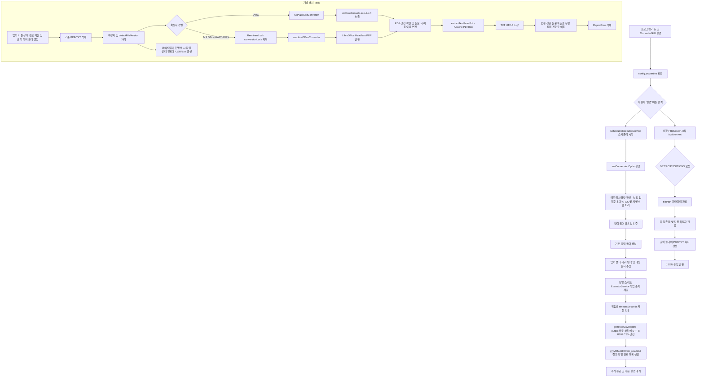

# [설계 문서] IPLMS Hybrid Converter (GUI & AutoCAD 확장형)

## 1. 개요 (Overview)

본 프로그램은 지정된 입력 폴더 내의 다양한 오피스 문서(MS Office, 한컴오피스) 및 **AutoCAD DWG 도면**을 주기적으로 탐색하여 PDF 변환, PDF 텍스트 추출, 변환 리포트 생성을 수행하는 Java 기반 하이브리드 문서 변환 엔진입니다.

* **하이브리드 아키텍처**: Java 제어 로직과 LibreOffice(오피스/한글 문서), AutoCAD AcCoreConsole(DWG 도면), Apache PDFBox(텍스트 추출)를 결합합니다.
* **지원 포맷**:
  * **MS Office**: Word(.docx, .doc), Excel(.xlsx, .xls), PowerPoint(.pptx, .ppt)
  * **한컴오피스**: HWP(.hwp), HWPX(.hwpx)
  * **AutoCAD**: DWG(.dwg)
* **주요 기능**: Swing GUI 기반 서비스 제어, 컬러 태그 실시간 로그, 일자별 파일 로그, 단일 스레드 순차 배치 변환, 내장 HTTP REST API 기반 단일 파일 즉시 변환, CSV 리포트 및 결과 목록 생성.

---

## 2. 상세 비즈니스 프로세스 흐름 (Detailed Flow Diagram)

프로그램 기동부터 정기 변환 주기, REST API 처리, 산출물 생성까지의 전체 프로세스 흐름입니다.


```mermaid
graph TD
    A[프로그램 기동 및 ConverterGUI 실행] --> B[config.properties 로드]
    B --> C{사용자 '실행' 버튼 클릭}
    C --> D[ScheduledExecutorService 스케줄러 시작]
    C --> API[내장 HttpServer 시작 /api/convert]

    D --> E[runConversionCycle 실행]
    E --> F[메모리 사용량 확인 - 설정 임계값 초과 시 GC 및 치명 오류 처리]
    F --> G[입력 폴더 유효성 검증]
    G --> H[기본 출력 폴더 생성]
    H --> I[입력 폴더 재귀 탐색 및 대상 문서 수집]
    I --> J[단일 스레드 ExecutorService 작업 순차 제출]

    subgraph BatchTask[개별 배치 Task]
        K[입력 기준 상대 경로 계산 및 출력 하위 폴더 생성] --> L[기존 PDF/TXT 삭제]
        L --> M[확장자 및 detectFileVersion 처리]
        M --> N{확장자 판별}
        N -- DWG --> O[runAutoCadConverter]
        O --> P[AcCoreConsole.exe /i /s /l 호출]
        N -- MS Office/HWP/HWPX --> Q[ReentrantLock conversionLock 획득]
        Q --> R[runLibreOfficeConverter]
        R --> S[LibreOffice Headless PDF 변환]
        P --> T[PDF 생성 확인 및 필요 시 이동/이름 변경]
        S --> T
        T --> U[extractTextFromPdf - Apache PDFBox]
        U --> V[TXT UTF-8 저장]
        V --> W[변환 성공 원본 파일을 동일 상대 경로로 이동]
        W --> X[ReportRow 적재]
        M --> Y[예외/타임아웃 발생 시 동일 상대 경로에 *_ERR.txt 생성]
    end

    J --> BA[작업별 timeoutSeconds 제한 적용]
    BA --> BB[generateCsvReport - output 바로 하위에 UTF-8 BOM CSV 생성]
    BB --> BC[yyyyMMddHHmm_result.txt 결과 파일 경로 목록 생성]
    BC --> AA[주기 종료 및 다음 실행 대기]

    API --> AB{GET/POST/OPTIONS 요청}
    AB --> AC[filePath 파라미터 파싱]
    AC --> AD[파일 존재 및 지원 확장자 검증]
    AD --> AE[출력 폴더에 PDF/TXT 즉시 생성]
    AE --> AF[JSON 응답 반환]
```

---

## 3. 시스템 아키텍처 (System Architecture)

1. **GUI (`ConverterGUI`)**
   
   * `JFrame` 기반 메인 윈도우(800x600)를 제공합니다.
   * `JTextPane`과 `StyledDocument`를 사용하여 로그 태그별 색상 스타일을 적용합니다.
   * 제공 버튼: `실행`, `종료`, `출력 폴더 열기`, `로그 지우기`.
   * 표준 출력/오류를 GUI 콘솔로 리다이렉션하고, 동일 내용을 일자별 로그 파일로 저장합니다.

2. **메인 스케줄러**
   
   * `ScheduledExecutorService`를 사용하여 `daemon.interval.minutes` 설정 주기마다 `ConverterMain.runConversionCycle()`을 실행합니다.
   * 배치 변환 내부는 `Executors.newSingleThreadExecutor()`로 구성되어 대상 파일을 순차 처리합니다.

3. **내장 웹 서버**
   
   * Java 내장 `HttpServer`를 사용합니다.
   * `/api/convert` 엔드포인트를 통해 단일 파일 즉시 변환 요청을 처리합니다.
   * 서비스 시작 시 서버를 시작하고, 서비스 종료 시 `stop(2)`로 종료합니다.

4. **변환 제어 유닛 (`ConverterMain`)**
   
   * **LibreOffice Engine**: MS Office, HWP, HWPX 문서의 PDF 변환을 담당합니다.
   * **AutoCAD AcCoreConsole**: DWG 도면의 PDF 변환을 담당합니다.
   * **Apache PDFBox**: 변환된 PDF에서 텍스트를 추출하여 UTF-8 TXT 파일을 생성합니다.
   * **리포트 큐**: `ConcurrentLinkedQueue<ReportRow>`에 변환 결과를 적재한 뒤 CSV로 출력합니다.

---

## 4. 신뢰성 및 예외 가드 설계 (Reliability Guards)

* **LibreOffice 동시성 가드**: REST API와 배치 작업 간 LibreOffice 동시 호출 충돌을 방지하기 위해 `ReentrantLock conversionLock`으로 변환 구간 진입을 제어합니다.
* **단일 스레드 배치 처리**: 정기 변환 대상 파일은 단일 스레드 Executor에서 순차 처리하여 파일 잠금과 엔진 경합을 줄입니다.
* **타임아웃 가드**:
  * 일반 문서 변환은 `converter.timeout.seconds` 값을 사용합니다. 기본값은 90초입니다.
  * DWG 변환은 `converter.autocad.timeout.seconds` 값을 별도로 사용합니다. 기본값은 120초입니다.
  * 제한 시간을 초과하면 프로세스를 강제 종료하고 실패 리포트 및 오류 파일을 생성합니다.
* **메모리 가드**: 주기 시작 시 JVM Heap 사용량을 확인하며, `converter.memory.limit.bytes` 설정값 초과 시 GC를 수행합니다. GC 후에도 초과 상태가 유지되면 `SYSTEM_FATAL_ERROR.txt`를 기록하고 프로세스를 종료합니다.
* **무결성 덮어쓰기 가드**: 변환 시작 전 기존 결과물 `.pdf`, `.txt`를 삭제하여 stale 파일과 파일 잠금 영향을 줄입니다.
* **오류 파일 생성**: 변환 중 예외 또는 타임아웃 발생 시 원본 파일명 기반 `*_ERR.txt`를 생성하고 오류 상세를 기록합니다.
* **엑셀 인코딩 가드 (UTF-8 BOM)**: CSV 리포트 생성 시 `\uFEFF` BOM을 선두에 기록하여 Excel에서 한글 깨짐을 방지합니다.
* **CSV Escape 처리**: 쉼표, 큰따옴표, 개행이 포함된 값은 CSV 규칙에 맞게 큰따옴표로 감싸고 내부 큰따옴표를 이스케이프합니다.


### 4.1. 프로세스 및 메모리 신뢰성 보장 (추가)

* **LibreOffice 사용자 프로필 격리 (UserInstallation)**:
  * LibreOffice 실행 시 사용자 프로필 동시 접근 충돌을 방지하기 위해 `converter.libreoffice.profile.path` 기반으로 `-env:UserInstallation` 옵션을 주입합니다.
* **GUI 콘솔 메모리 버퍼 제어**:
  * `ConverterGUI`의 `JTextPane` 버퍼 크기가 `converter.gui.log.max.length`(기본 500,000자)를 초과할 경우, 상위 50%의 오래된 로그를 자동으로 삭제(Trim)하여 GUI 메모리 낭비를 방지합니다.
* **원본 이동 시 파일명 충돌 회피 (Unique File Naming)**:
  * 변환 성공 후 원본 파일을 출력 폴더로 이동 시, 동일 파일명이 이미 존재하는 경우 `파일명_1.ext`, `파일명_2.ext`와 같이 순번을 자동 부여하여 파일 덮어쓰기 손실을 방지합니다.
  * 

---

## 5. 설정 로딩 및 환경 설정 (`config.properties`)

### 5.1. 설정 파일 탐색 순서

`ConverterMain.loadProperties()`는 다음 순서로 `config.properties`를 탐색합니다.

1. 실행 중인 JAR 또는 클래스 파일 상위 폴더의 외장 `config.properties`
2. 현재 작업 디렉터리의 `config.properties`
3. 클래스패스 루트의 `/config.properties`
4. 위 경로에서 찾지 못하면 기본값 사용

### 5.2. 주요 설정 항목

```properties
# 입력/출력 폴더
converter.input.dir=c:\\IPLMS\\91_input
converter.output.dir=c:\\IPLMS\\92_output

# 일반 문서 변환 timeout
converter.timeout.seconds=90

# LibreOffice 실행 파일 경로
converter.libreoffice.path=c:\\IPLMS\\LibreOfficePortable\\LibreOfficePortable.exe

# 변환 결과 CSV 파일명
converter.report.excel.name=conversion_report.csv

# 데몬 실행 주기(분)
daemon.interval.minutes=10

# 내장 HTTP 서버 포트
converter.server.port=9119

# AutoCAD AcCoreConsole 설정
converter.autocad.path=C:\\Program Files\\Autodesk\\AutoCAD 2024\\accoreconsole.exe
converter.autocad.script.path=C:\\IPLMS\\scripts\\dwg2pdf.scr
converter.autocad.timeout.seconds=120

# GUI 및 파일 로그 설정
converter.log.dir=C:\\IPLMS\\95_logs
converter.gui.log.max.length=500000

# JVM Heap 메모리 사용량 제한(bytes)
converter.memory.limit.bytes=2147483648
```

---

## 6. 변환 엔진 상세 설계

### 6.1. LibreOffice 변환

* **MS Office (Word, Excel) & 공통 문서**

```text
  soffice --headless --norestore -env:UserInstallation=file:///<profile_path>/libreoffice_profile --convert-to pdf:<filter> --outdir <output_dir> <src_file>
```

* HWP/HWPX 계열은 HWP 입력 필터와 Writer PDF Export 필터를 사용합니다.

```text
soffice --headless --infilter=Hwp2002_File --convert-to pdf:writer_pdf_Export --outdir <output_dir> <src_file>
```

* 변환 완료 후 LibreOffice가 생성한 기본 PDF 파일명을 확인하고, 목표 파일명과 다르면 이동/이름 변경합니다.

### 6.2. AutoCAD DWG 변환

도면 재현율을 높이기 위해 AutoCAD의 정식 콘솔 엔진인 `AcCoreConsole.exe`를 활용합니다.

* **CLI 호출 방식**

```text
accoreconsole.exe /i "입력파일.dwg" /s "스크립트.scr" /l "en-US"
```

* **실행 전 검증**
  
  * `converter.autocad.path` 값이 비어 있지 않은지 확인합니다.
  * `AcCoreConsole.exe` 파일 존재 여부를 확인합니다.
  * `converter.autocad.script.path` 값과 `.scr` 파일 존재 여부를 확인합니다.

* **운영 고려 사항**
  
  * 운영 서버에 AutoCAD 정식 라이선스가 활성화되어 있어야 합니다.
  * DWG 렌더링 품질을 위해 도면에서 사용하는 SHX 폰트가 시스템에 사전 설치되어야 합니다.
  * 생성 PDF는 우선 출력 폴더에서 확인하고, 없을 경우 원본 파일 폴더에서도 확인합니다.

### 6.3. PDF 텍스트 추출

* `PDDocument.load(pdfFile)`로 PDF를 로드합니다.
* `PDFTextStripper`로 텍스트를 추출합니다.
* 결과 TXT는 UTF-8 인코딩으로 저장합니다.
* 텍스트 추출 실패는 전체 변환 실패로 즉시 중단하지 않고 경고로 처리합니다.

---

## 7. REST API 사용 가이드 (REST API Guide)

### 7.1. 기본 정보

* **엔드포인트**: `http://[IP]:9119/api/convert` (`converter.server.port`로 변경 가능)
* **지원 메소드**: `GET`, `POST`, `OPTIONS`
* **CORS**: `Access-Control-Allow-Origin: *`를 기본 적용합니다.
* **지원 POST 형식**:
  * `application/json`
  * `application/x-www-form-urlencoded` 또는 JSON이 아닌 일반 body의 query string 형식

### 7.2. 요청 예제

* **GET**

```text
http://[IP]:9119/api/convert?filePath=C:/IPLMS/91_input/sample.hwp
```

* **POST JSON**

```json
{ "filePath": "C:\\IPLMS\\91_input\\sample.dwg" }
```

* **POST Form URL Encoded**

```text
filePath=C%3A%5CIPLMS%5C91_input%5Csample.docx
```

### 7.3. 성공 응답 예제

```json
{
  "status": "success",
  "pdfPath": "C:\\IPLMS\\92_output\\sample.pdf",
  "txtPath": "C:\\IPLMS\\92_output\\sample.txt",
  "txtExtracted": true,
  "extractedTextContent": "추출된 샘플 문서 텍스트 내용...",
  "elapsedTime": "13.02초"
}
```

### 7.4. 오류 응답

* `400`: `filePath` 누락 또는 지원하지 않는 확장자
* `404`: 요청 파일이 존재하지 않거나 일반 파일이 아님
* `405`: 지원하지 않는 HTTP Method
* `500`: 변환 실패 또는 변환 중 예외 발생

---

## 8. GUI 및 로그 설계

* GUI 콘솔은 `JTextPane` 기반이며 로그 내 `[태그]` 패턴을 감지하여 색상을 적용합니다.
* 주요 색상 정책:
  * 성공/검증 완료: 녹색
  * 오류/실패/FATAL: 빨간색
  * 경고/덮어쓰기: 주황색
  * 시스템 정보/HTTP/API: 파란색
  * 서비스 시작/탐색 완료: 보라색
  * 기타 태그: 회색
* 로그는 `converter.log.dir` 폴더에 `yyyyMMdd.log` 파일로 누적 저장합니다.
* 로그 일자가 변경되면 GUI 콘솔 문서를 초기화하고 GC를 수행하는 일자 전환 로직을 포함합니다.
* 출력 폴더 열기 버튼은 설정된 출력 폴더를 생성한 뒤 OS 탐색기로 엽니다.

---

## 9. 시스템 구축 및 설치 정보

* **권장 경로**: 모든 솔루션은 `C:\IPLMS` 루트 디렉터리에 설치하는 것을 권장합니다.
* **폴더 구조**:
  * `C:\IPLMS\91_input`: 원본 문서 보관
  * `C:\IPLMS\92_output`: 결과 PDF, TXT, 원본 이동 파일, CSV 리포트 및 결과 목록 저장
  * `C:\IPLMS\95_logs`: GUI/시스템 일자별 로그 저장
  * `C:\IPLMS\LibreOfficePortable`: LibreOffice 변환 엔진 영역
  * `C:\IPLMS\scripts`: AutoCAD 변환용 `.scr` 파일 보관
  * `C:\IPLMS\IPLMSDocsConverter_jar`: Java 프로그램 및 라이브러리 보관

---

## 10. 최종 산출물 스펙 (Output Spec)

### 10.1. 정기 배치 변환 산출물

* **출력 루트 폴더**: `converter.output.dir/`
* **하위 폴더 구조**: `converter.input.dir` 기준 상대 경로를 `converter.output.dir` 하위에 동일하게 생성
* **변환 PDF**: 원본 파일명 기반 `.pdf`, 원본과 동일한 상대 경로에 저장
* **텍스트 추출본**: 원본 파일명 기반 `.txt`, 원본과 동일한 상대 경로에 저장
* **원본 파일 이동본**: PDF 변환 성공 시 원본 파일을 동일 상대 경로로 이동
* **원본 파일명 충돌 처리**: 이동 대상 파일명이 이미 존재하면 `_1`, `_2` 순번을 붙여 저장
* **오류 파일**: 변환 실패 시 원본 파일명 기반 `*_ERR.txt`, 원본과 동일한 상대 경로에 저장
* **시스템 리포트**: `conversion_report.csv`, `converter.output.dir` 바로 하위에 저장
  * 컬럼: 번호, 파일경로, 파일명, 파일종류, pdf변환결과, 텍스트추출결과, 파일용량(KB), 소요시간(초)
* **실행 목록**: `yyyyMMddHHmm_result.txt`, `converter.output.dir` 바로 하위에 저장
  * 해당 주기에 생성 또는 생성 시도된 PDF/TXT/ERR/CSV 파일 경로 목록

### 10.2. REST API 즉시 변환 산출물

* **출력 위치**: `converter.output.dir`가 설정되어 있으면 해당 폴더, 비어 있으면 원본 파일 폴더
* **변환 PDF**: 원본 파일명 기반 `.pdf`
* **텍스트 추출본**: 원본 파일명 기반 `.txt`
* **응답 본문**: PDF/TXT 경로, 텍스트 추출 여부, 추출 텍스트 전문, 소요시간을 포함한 JSON
