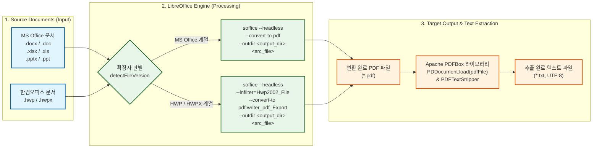

# [FN-260715-01] LibreOffice 엔진 연동 및 환경 구성

- **담당자:** 담당 개발자
- **문서 등록일:** 2026-07-15
- **프로젝트명:** Java 기반 문서 변환 시스템 고도화
- **상태:** `완료 (Completed)`

---

## 1. 개요 및 요구사항 (Requirements)

### 1.1 개요
문서 변환을 위한 기본 엔진으로 LibreOffice를 백그라운드 데몬(headless) 모드로 연동하고 실행 환경을 관리한다.

### 1.2 요구사항 상세
- [x] LibreOffice Headless 모드 실행 및 프로세스 제어
- [x] 서버 기동 시 CLI 명령어 자동 바인딩 및 OS별(Windows/Linux) 경로 자동 인식
- [x] 동시 변환 요청 처리를 위한 CLI 세션 관리 또는 큐(Queue) 처리 설계

---

## 2. 기술 설계 (Technical Design)

### 2.1 설계 요약
- Java ProcessBuilder를 사용하여 `soffice --headless ...` 명령어를 실행합니다. `config.properties`에서 설정된 LibreOffice 설치 경로(`converter.libreoffice.path`)를 조회 및 연동하여 동작하도록 구현되었습니다.
- 대용량 일괄 정기 변환 시의 안전한 순차 처리(`ExecutorService`)와 내장 HTTP 서버를 통한 단일 실시간 변환 요청 처리 시 발생할 수 있는 경합을 방지하기 위하여 `ReentrantLock` 뮤텍스 잠금 기반 동시성 처리가 보장됩니다.

### 2.2 문서 변환 및 텍스트 추출 흐름 (Diagram)
원본 문서(MS Office, 한글 HWP/HWPX)가 LibreOffice Engine을 통과하여 PDF 파일로 변환된 후, Apache PDFBox를 통해 텍스트로 추출되는 전체 흐름입니다.

### 2.3 예정 사항 (Next Steps)
- [ ] AutoCAD(DWG/DXF) 파일을 PDF로 변환하는 모듈 연구 및 추가 설계 (LibreOffice 외에 제3의 렌더러 연동 ��토)
- [ ] 서버 구동 환경(OS별 LibreOffice 패키지 설치 및 폰트 수동 설치)을 정리한 설치 가이드(Setup Guide) 문서 작성

---

## 3. 테스트 케이스 (Test Cases)

### 3.1 단위 및 통합 테스트 시나리오
- [ ] CentOS 및 Windows 환경에서 LibreOffice 데몬 구동 프로세스 모니터링 테스트

---

## 4. Git 및 작업 이력 가이드 (Git History Guide)

### 4.1 커밋 메시지 규칙
- **최초 구현 커밋:** `feat: [FN-260715-01] [기능명] 최초 기능 구현 및 API 설계`
- **리팩토링 및 버그 수정:** `refactor: [FN-260715-01] [기능명] 예외 처리 로직 추가 및 가독성 개선`
